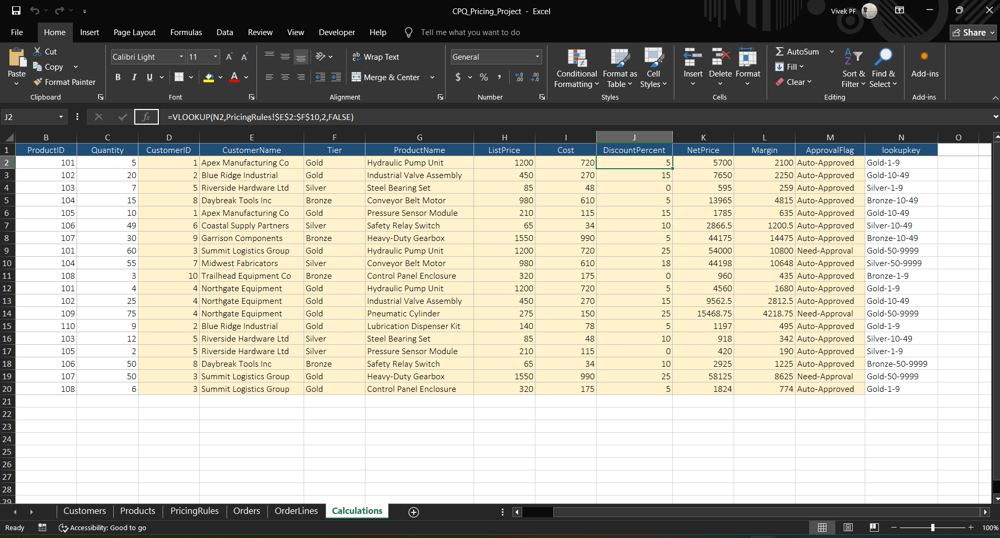
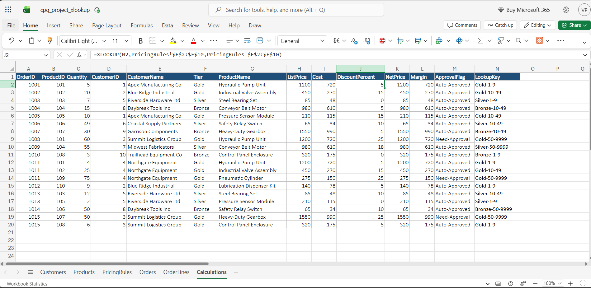

# Tiered Pricing & Discount Rule Engine

A SQL + Excel simulation of CPQ (Configure-Price-Quote) pricing logic — built to demonstrate rule-based pricing, discount governance, and Quote-to-Cash concepts using SQL Server and Excel, ahead of an Associate Engineer – Pricing/CPQ role.

> 📄 Full write-up with detailed reasoning: [`docs/Project_Writeup.docx`](docs/Project_Writeup.docx)

---

## What this project does

Given a customer's **tier** (Gold / Silver / Bronze) and **order quantity**, the engine:

1. Looks up the applicable discount rule (tier + quantity band → discount %)
2. Calculates **Net Price** and **Margin** per order line
3. Flags any line with a discount **> 20%** for manager approval — mirroring real CPQ discount-governance workflows

Built twice, independently: once in **SQL Server** (JOINs, CASE WHEN, GROUP BY), once in **Excel** (VLOOKUP, nested IF, XLOOKUP) — to show the same business logic translated across both tools.

---

## Data Model

| Table | Purpose |
|---|---|
| `Customers` | Customer + tier (Gold/Silver/Bronze) |
| `Products` | Product catalogue with `ListPrice` and `Cost` |
| `PricingRules` | The rule engine — Tier + quantity band → `DiscountPercent` |
| `Orders` | Order header (customer, date) |
| `OrderLines` | Order detail — one row per product per order (composite key: `OrderID`, `ProductID`) |

Key design choices: non-overlapping quantity bands (prevents join fan-out/duplicate rows), `CHECK` constraints on `Tier` (prevents silently-dropped rows on INNER JOIN), and `Cost` stored separately from `ListPrice` (required to calculate Margin, not just discount).

---

## SQL Highlights

```sql
-- Core pricing calculation (simplified)
SELECT 
    ol.OrderID, ol.ProductID, c.Tier, ol.Quantity,
    pr.DiscountPercent,
    CAST(ol.Quantity * p.ListPrice 
         - (ol.Quantity * p.ListPrice * pr.DiscountPercent / 100) AS DECIMAL(10,2)) AS NetPrice,
    CASE WHEN pr.DiscountPercent > 20 THEN 'Needs Approval' ELSE 'Auto-Approved' END AS ApprovalFlag
FROM OrderLines ol
JOIN Orders o ON ol.OrderID = o.OrderID
JOIN Customers c ON o.CustomerID = c.CustomerID
JOIN Products p ON ol.ProductID = p.ProductID
JOIN PricingRules pr ON c.Tier = pr.Tier 
                     AND ol.Quantity BETWEEN pr.MinQty AND pr.MaxQty
```

**Aggregate result — Total Margin by Tier:**

| Tier | Total Net Revenue | Total Margin | Order Lines |
|---|---|---|---|
| Gold | $159,872.25 | $34,390.25 | 10 |
| Bronze | $62,025.00 | $20,950.00 | 4 |
| Silver | $48,997.50 | $12,639.50 | 5 |

Out of 19 order lines, **3 lines** (all Gold-tier, 50+ units, 25% discount) exceeded the 20% governance threshold and were routed for approval.

📁 Full SQL scripts: [`/sql`](sql/)

---

## Excel Mirror

The same logic rebuilt with spreadsheet formulas:

- `VLOOKUP` with absolute references to pull customer/product/tier data
- Nested `IF` to classify quantity into a pricing band
- A concatenated helper key (`Tier & "-" & Band`) to work around VLOOKUP's single-column-match limit — simulating the SQL JOIN's two-condition match (Tier + Quantity range)
- `IF(DiscountPercent>20, "Needs Approval", "Auto-Approved")` for the approval flag
- An **XLOOKUP** equivalent built separately in Excel Online (XLOOKUP isn't available in Excel 2019)

📁 Workbooks: [`/excel/CPQ_Pricing_Project.xlsx`](excel/CPQ_Pricing_Project.xlsx)
              [`/excel/cpq_project_xlookup.xlsx`](excel/cpq_project_xlookup.xlsx)

**Screenshots:**

| VLOOKUP formulas (Excel 2019) | XLOOKUP equivalent (Excel Online) |
|---|---|
|  |  |

---

## Connecting to Quote-to-Cash & Discount Governance

CPQ platforms own the front half of the Quote-to-Cash pipeline:

**Configure → Price → Quote → Approve** → *(Order → Invoice → Cash, outside this project's scope)*

| Q2C Stage | This Project |
|---|---|
| Configure | Product + quantity selection |
| Price | `PricingRules` engine |
| Quote | `NetPrice` / `Margin` |
| Approve | `ApprovalFlag` — the governance checkpoint |

Discount governance exists because sales reps are typically measured on closing deals — which creates pressure to discount aggressively, sometimes at the expense of margin. An approval workflow inserts a checkpoint so someone with margin visibility reviews discounts above a defined risk threshold, without removing day-to-day pricing flexibility for reps operating within approved bounds.

---

## Project expansion possibilities

- Bundle / multi-product pricing rules
- Contract-specific customer price overrides
- Multi-currency support
- An approval workflow status field (Pending/Approved/Rejected + approver + timestamp)
- A Power BI / Excel dashboard layer on top of the aggregate queries

---

## Tech Stack

`SQL Server` · `T-SQL` · `Excel (VLOOKUP, nested IF, XLOOKUP)` · `Excel Online`
